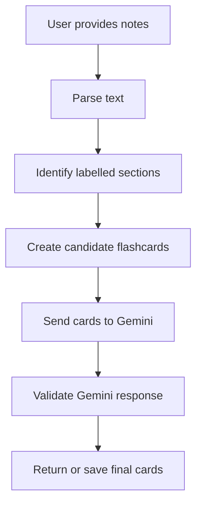

# AI Flashcard Generator — Program Map

## 1. Program purpose

This program converts notes into flashcards. It first parses the notes using
Python, then sends the generated flashcards to Gemini for improvement (todo)

## 2. Overall flow



## 2.5. Program Architecture
1. Program runs "user_input_list()"
    Accept bulk user input, convert into lists of lines.
2. run "extract_flashcards" (main function) line by line
    Accepts individual line as parameter
    1. "clean_text(text)"
        1.  Converts newline formats with different OS into standard
        2. Collapse multiple empty space into one
        3. Fix spaces around punctuation
        4. Collapse multiple spaces
    2. 
    

## 3. Project files

| File | Purpose |
|---|---|
| `main.py` | Starts the program and controls the overall process |
| `parser.py` | Processes the notes and identifies text sections |
| `gemini_client.py` | Communicates with the Gemini API |
| `models.py` | Defines the structure of flashcards |
| `tests/test_parser.py` | Tests the parsing functions |
| `.env` | Stores the Gemini API key; never upload this file |
| `requirements.txt` | Lists the required Python packages |

Update this table to match the files that actually exist in the project.

## 4. Important data structures

### Flashcard

A flashcard is represented using a dictionary:

```python
{
    "question": "What is photosynthesis?",
    "answer": "The process plants use to convert light into energy."
}
```

### Labelled block

A labelled block is represented as:

```python
{
    "label": "Definition",
    "content": "Photosynthesis is..."
}
```

## 5. Main execution path

When the program runs:

1. `main.py` reads the user's notes.
2. `merge_label_blocks()` groups labelled sections with their content.
3. Another parser function converts the sections into candidate flashcards.
4. The candidates are sent to Gemini.
5. Gemini returns improved flashcards.
6. The response is validated.
7. The final flashcards are displayed or saved.

## 6. Function map

### `merge_label_blocks(text)`

**Location:** `parser.py`

**Purpose:**  
Find labelled sections in the input and combine each label with its content.

**Input:**

```python
text: str
```

**Output:**

```python
list[dict]
```

**Example:**

```python
text = """Definition: The meaning of a concept
This line continues the definition."""
```

Expected result:

```python
[
    {
        "label": "Definition",
        "content": "The meaning of a concept\nThis line continues the definition"
    }
]
```

**How it works:**

1. Splits the text into lines.
2. Checks whether each line begins with a label.
3. Starts a new block when it finds a label.
4. Adds following lines to the current block.
5. Returns all completed blocks.

**Calls:**

- `re.match()` to recognize labels

**Called by:**

- `generate_flashcards()` <!-- Replace this with the actual caller -->

**Possible edge cases:**

- Empty input
- A label with no content
- A continuation line before any label
- Labels longer than the allowed length
- Lowercase labels

## 7. External services

### Gemini API

**Used for:** Improving candidate flashcards.

**Model:** `gemini-2.5-flash`

**API key source:** `GEMINI_API_KEY` environment variable

**Important:** The API request runs in the cloud, not locally.

## 8. Parts I currently understand

- [x] How the environment variable is loaded
- [x] How text is split into lines
- [ ] How labelled lines are detected with regex
- [ ] How candidate cards are sent to Gemini
- [ ] How Gemini responses are validated

## 9. Questions to investigate

- Which function calls `merge_label_blocks()`?
- What happens if Gemini returns invalid data?
- Where are the final flashcards stored?
- Which functions depend on Gemini?
- Can the parsing stage run without internet access?

## 10. Last updated

**Date:** 2026-08-01

**Current focus:** Understanding the text-parsing pipeline.