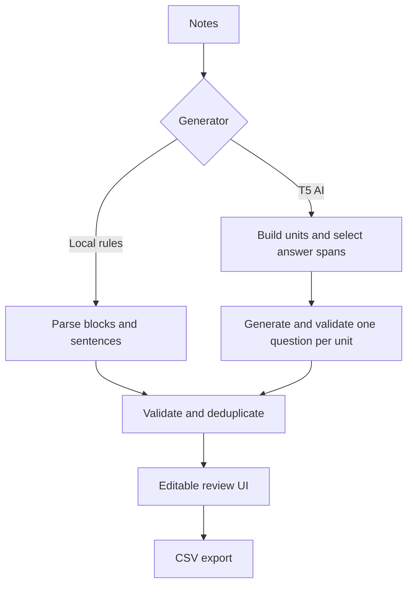

# Program map

Recall has two generation paths behind one Flask API.

| File | Responsibility |
|---|---|
| `src/flashcard_generator/generator.py` | Deterministic parsing, card creation, and deduplication |
| `src/flashcard_generator/ai.py` | Lazy T5 runtime, source units, answer selection, and question validation |
| `src/flashcard_generator/jobs.py` | One bounded background worker with progress and cancellation |
| `src/flashcard_generator/importers.py` | TXT, Markdown, and text-based PDF extraction |
| `src/flashcard_generator/web.py` | Flask pages and JSON endpoints |
| `src/flashcard_generator/templates/index.html` | UI structure |
| `src/flashcard_generator/static/app.js` | UI state, polling, editing, and CSV export |
| `tests/` | Python pipeline/API and JavaScript interface regressions |

The AI path runs `mrm8488/t5-base-finetuned-question-generation-ap` inside the Python process. Transformers
downloads it automatically on first use and caches it. The app needs neither an API key nor a separate model
server.
