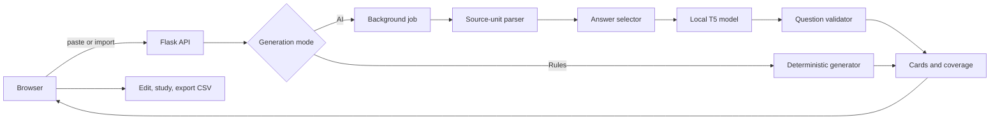

# Architecture

Recall is a single-process, local Flask application with two generation engines. The browser owns the editable
deck. The Python server imports source text, generates cards, and returns validation evidence; it does not save
the user's notes or deck to a database.

## System flow



## Component boundaries

| Component | Owns | Does not own |
|---|---|---|
| `web.py` | Flask creation, payload validation, routes, HTTP errors | Model prompts or parsing rules |
| `ai.py` | AI source units, answer spans, model loading, inference, validation, coverage | HTML or file extraction |
| `generator.py` | Shared text normalization and deterministic card rules | Model loading or HTTP state |
| `importers.py` | Bounded TXT, Markdown, and PDF extraction | Generation decisions |
| `jobs.py` | One-worker background execution, progress, cancellation, expiry | Generation algorithms |
| `app.js` | Browser state, polling, editing, study mode, CSV export | Model inference |
| `index.html` / `app.css` | Semantic page structure and presentation | Server logic |

The separation keeps the model replaceable. A new compatible question-generation provider can be introduced in
`ai.py` without changing importing, job management, card editing, or export.

## Entry points

- `python run.py` is the documented launcher.
- `python FlashcardGenerator.py` remains for compatibility with older shortcuts.
- `python -m flashcard_generator` runs the package entry point.
- Installing the package adds the `recall-flashcards` console command.

Every entry point delegates to `flashcard_generator.web.run()`.

## Browser and API lifecycle

On startup, Flask serves `templates/index.html` with `static/app.js` and `static/app.css`. The browser stores the
draft note text in `localStorage`. Cards remain in JavaScript memory unless the user exports them.

The main routes are:

| Method and route | Purpose |
|---|---|
| `GET /` | Render the application |
| `GET /api/status` | Report dependency, model-cache, and in-memory load status without loading weights |
| `POST /api/import` | Extract bounded text from TXT, Markdown, or PDF |
| `POST /api/generate` | Synchronous generation, primarily local rules and programmatic clients |
| `POST /api/jobs` | Start background AI generation |
| `GET /api/jobs/<id>` | Poll job progress or retrieve the result |
| `POST /api/jobs/<id>/cancel` | Request cooperative cancellation |

The frontend uses the synchronous endpoint for rules mode and the job endpoints for AI mode.

## Shared parsing

`generator.py` supplies three shared operations:

1. `clean_text()` normalizes whitespace without collapsing paragraph boundaries.
2. `parse_blocks()` separates labelled notes such as `Velocity: ...` from ordinary paragraphs.
3. `split_sentences()` performs a small, download-free sentence split while protecting common abbreviations.

The deterministic generator then recognizes labelled definitions, explicit question/answer pairs, definition
sentences, and quantities with known units. Unsupported prose is skipped rather than guessed.

## AI generation pipeline

### 1. Build bounded source units

`source_units()` turns parsed text into units no longer than 420 characters. It keeps explicit questions with
their following answer when possible. Processing is capped at 500 usable units to prevent accidental unbounded
work.

Each `SourceUnit` contains:

- A stable ID such as `U1`
- The source text presented as context
- Its position
- A literal answer span selected from that text

### 2. Select the answer before inference

`_answer_span()` prefers structured evidence in this order:

1. The answer following an explicit question
2. The content of a labelled block
3. The right-hand side of a definition
4. A recognized numerical or written quantity with a unit
5. The statement following `states that`
6. The complete source sentence as a conservative fallback

The answer is therefore controlled by local code and must remain a substring of the source unit.

### 3. Load the model lazily

`HuggingFaceProvider.prepare()` loads
`mrm8488/t5-base-finetuned-question-generation-ap` through Transformers only when AI generation is requested.

`from_pretrained()` downloads missing files on first use. `_model_is_cached()` detects a complete local model so
later launches can use `local_files_only=True`, avoiding unnecessary network checks. A process-level runtime
cache prevents repeated weight loading during the same server session.

Device selection follows this order:

1. Explicit `HF_DEVICE`, if valid and available
2. CUDA
3. Apple MPS
4. CPU

### 4. Generate one question per unit

The fine-tuned model receives a short answer-aware prompt:

```text
answer: one byte context: An address identifies one byte. </s>
```

Deterministic decoding is used: sampling is disabled and generation is limited to 64 new tokens. The model
returns only the question. The card back never comes from model output.

### 5. Validate and deduplicate

`parse_model_response()` accepts one non-vague question ending in `?`. It rejects multiline responses,
statements, empty output, tautologies, vague pronoun questions, and any answer that is no longer present in its
source.

Accepted cards carry `front`, `back`, `card_type`, `source`, `fact_ids`, and generator metadata. Exact
question-answer duplicates are removed. A user-supplied card limit is applied only after every unit has been
attempted, so excluded units can still be reported.

### 6. Return coverage honestly

The coverage object reports identified units, accepted units, validation failures, duplicates, card-limit
exclusions, and inference-pass count.

This is source-unit coverage, not semantic fact coverage. A unit may contain several facts, and a valid grounded
answer can still be paired with a mediocre question. The UI keeps the source excerpt visible and marks coverage
stale after manual edits.

## Background jobs and cancellation

`JobStore` uses a `ThreadPoolExecutor` with one worker. This prevents simultaneous model jobs from competing for
RAM or GPU memory. A second submission receives a conflict response until the active job completes or is
cancelled.

Jobs move through `queued`, `running`, `completed`, `failed`, or `cancelled`. Progress and results live in memory.
Finished jobs expire after 30 minutes, and only the ten newest finished jobs are retained.

Cancellation uses a `threading.Event`. The AI loop checks it before and after each inference pass. PyTorch is not
interrupted in the middle of a pass, so cancellation is cooperative rather than instantaneous.

## Import limits and persistence

`importers.py` enforces:

- 10 MB maximum upload
- 200 PDF pages
- 200,000 extracted characters
- UTF-8 text for TXT and Markdown
- Valid, unlocked PDFs with embedded text

Files are read into memory. Scanned pages and diagrams are not sent to OCR. The server does not persist notes,
cards, or jobs. Hugging Face model files are the only long-lived runtime cache created by the AI path.

## Failure semantics

Model errors are converted to stable public error codes without returning raw exception text or source notes.
The browser preserves the existing deck when a new attempt fails or produces zero accepted cards. AI failures do
not silently fall back to rules mode because that could make a lower-coverage result appear equivalent.

## Test strategy

- `test_generator.py` checks normalization, block parsing, deterministic generation, and deduplication.
- `test_ai.py` injects a scripted provider to test orchestration without downloading weights in CI.
- `test_importers.py` checks file types, size limits, malformed input, and PDF handling.
- `test_web.py` checks routes, payload validation, status reporting, and failure isolation.
- `ui.test.cjs` runs the browser code in JSDOM and checks editing, polling, timeouts, storage failures, and export
  state.
- GitHub Actions runs Ruff, Python tests with coverage, and Node tests on every push and pull request.

The real checkpoint still needs a separate live smoke test because mocked tests cannot measure question quality,
download behavior, or hardware-specific inference.
