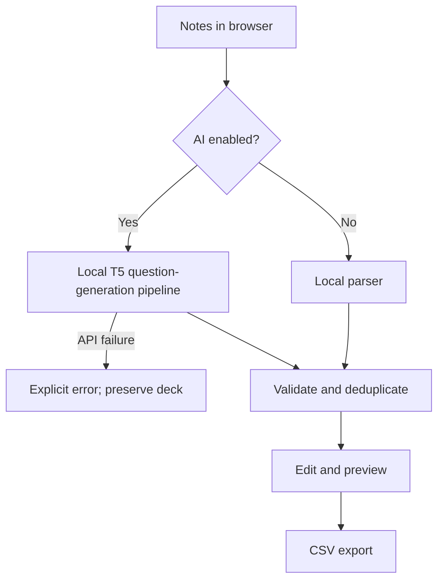

# Architecture

The application has three deliberately separate layers:

1. `generator.py` parses notes and creates deterministic cards without network access.
2. `ai.py` builds bounded source units, selects answer spans, runs a question-generation T5 model, and reports
   unit coverage.
3. `web.py` exposes the UI/API and `jobs.py` runs one background job with progress and cancellation.
   Transformers runs T5 in the Python process. AI is the default; local rules must be selected explicitly.

## Local generation pipeline

The local parser preserves paragraphs, identifies `Label: content` blocks, pairs explicit questions with the
following sentence, recognizes common definition patterns, and creates quantity-with-unit cloze cards.
Uncertain text is skipped. No language model runs in local mode.
All local answers are copied from the source notes.

## AI generation pipeline

The parser divides notes into labelled blocks, sentences, and explicit question/answer pairs, then bounds long
units for T5's input window. The parser selects a literal answer span from each unit, then the model receives the
answer and its context and returns one question. The model never writes the card back. Local validation rejects
malformed output, non-questions, tautologies, vague questions, and duplicates.

The optional card cap is applied only after every source unit has been attempted. The coverage report lists
units that were skipped or rejected. Source-unit coverage is not a proof that every fact was identified: a
single sentence may contain several facts, and a small model can ask a weak question even when its quoted answer
is grounded. The UI discloses this and marks coverage stale after manual edits.

The model loads lazily inside the Python process. `from_pretrained()` downloads the configured Hugging Face
checkpoint on first use and reuses the local cache later. Deterministic decoding and bounded prompts keep runs
repeatable. Source notes are treated as untrusted data; the model has no tools or filesystem access.

## Background jobs

`POST /api/jobs` starts generation, `GET /api/jobs/<id>` polls progress/results, and
`POST /api/jobs/<id>/cancel` sets a cooperative cancellation flag checked between requests. One worker prevents
unbounded CPU/GPU load. Finished jobs expire after 30 minutes and only ten are retained. Jobs and results
stay in memory; the browser stores the job ID in session storage to reconnect after refresh. Restarting the
server invalidates jobs. This is a single-process, single-user local application, not a multi-worker service.
The synchronous `/api/generate` endpoint remains available for scripts.

## Failure behavior

AI failures return an explicit error, never local cards. The UI preserves the previous deck on errors or empty
responses. Browser notes use best-effort local storage; storage failures never prevent interaction.
PDF text extraction is local via pypdf. Scanned pages require OCR and generate a warning or an error.
Model download and inference errors are mapped to safe error codes rather than exposing source text or cache
paths. Cancellation waits for the current inference pass; it does not forcibly interrupt PyTorch.
