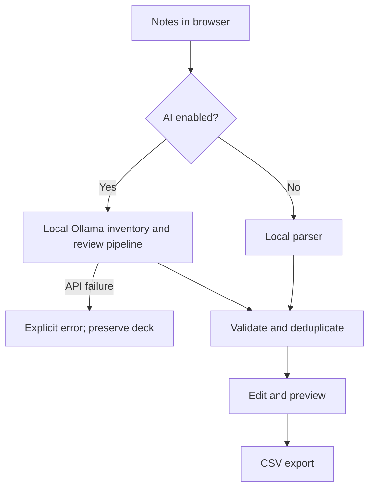

# Architecture

The application has three deliberately separate layers:

1. `generator.py` parses notes and creates deterministic cards without network access.
2. `ai.py` inventories and audits facts, drafts and reviews cards, and calculates traceable coverage.
3. `web.py` exposes the UI/API and `jobs.py` runs one background job with progress and cancellation.
   Ollama runs the model locally. AI is the default; local rules must be selected explicitly.

## Local generation pipeline

The local parser preserves paragraphs, identifies `Label: content` blocks, pairs explicit questions with the
following sentence, recognizes common definition patterns, and creates quantity-with-unit cloze cards.
Uncertain text is skipped. No language model runs in local mode.
All local answers are copied from the source notes.

## AI generation pipeline

The entire input is losslessly split into sections, with neighboring context for headings. Each section gets
an inventory request and an omission audit. Source excerpt matching tolerates whitespace differences but
requires an exact, contiguous quote from the owned section. Unlocatable evidence is reported separately.
The audited inventory supersedes the draft, so corrected misinterpretations cannot reappear in card prompts.
Every removed or reworded draft objective is listed in the report for human inspection; the audit cannot
silently discard it. Later card review must still compare interpretations against the quoted evidence.

Facts have stable IDs. Batches of up to 12 facts receive separate drafting and review requests. A bounded
repair pass targets missing IDs. Only reviewed cards are considered for deterministic validation. Unknown IDs,
tautologies and vague pronoun questions are rejected. Exact duplicate question/answers merge evidence;
conflicting answers to an identical question are removed and their facts become coverage gaps.

Caps are applied after every section has been processed. Coverage is computed from accepted cards' fact IDs;
it is not a semantic proof. Model errors can survive all passes, and a fact missed by both extraction calls
will not appear in the denominator. The UI discloses this and marks counts stale after manual edits.

Requests use Ollama structured outputs with Pydantic schemas, zero temperature, an explicit system instruction,
and a configurable timeout. Source notes are delimited as untrusted data. This reduces but cannot
guarantee immunity to source prompt injection. The model has no tools or filesystem access.

## Background jobs

`POST /api/jobs` starts generation, `GET /api/jobs/<id>` polls progress/results, and
`POST /api/jobs/<id>/cancel` sets a cooperative cancellation flag checked between requests. One worker prevents
unbounded CPU/GPU load. Finished jobs expire after 30 minutes and only ten are retained. Jobs and results
stay in memory; the browser stores the job ID in session storage to reconnect after refresh. Restarting the
server invalidates jobs. This is a single-process, single-user local application, not a multi-worker service.
The synchronous `/api/generate` endpoint remains available for scripts.

## Failure behavior

AI failures return an explicit error, never local cards. The UI preserves the previous deck on errors or empty
responses. Browser notes use best-effort local storage; storage failures never prevent interaction.
PDF text extraction is local via pypdf. Scanned pages require OCR and generate a warning or an error.
Ollama errors are mapped to safe error codes rather than exposing raw responses or source text.
Cancellation waits for the current request; it does not forcibly terminate local inference.
