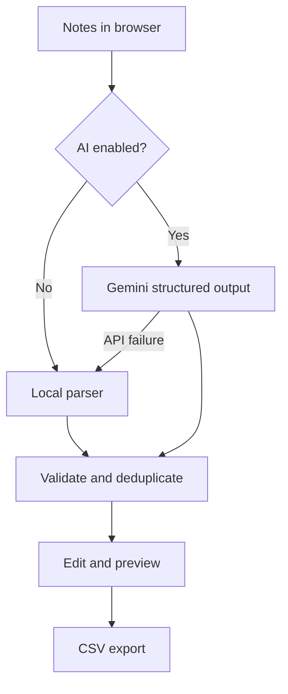

# Architecture

The application has three deliberately separate layers:

1. `generator.py` parses notes and creates deterministic cards without network access.
2. `ai.py` optionally asks Gemini for structured cards and validates the response with Pydantic.
3. `web.py` exposes the browser UI and JSON API while keeping the API key on the server.

## Local generation pipeline

The local parser preserves paragraphs, identifies `Label: content` blocks, pairs explicit questions with the
following sentence, recognizes common definition patterns, and converts other factual sentences to cloze cards.
All local answers are copied from the source notes.

## AI generation pipeline

The Gemini request uses a low temperature and a Pydantic response schema. The prompt tells the model to treat
the notes as untrusted source text, use only facts in those notes, create atomic recall questions, and preserve
technical notation. The response is validated, normalized, deduplicated, and capped before it reaches the UI.

## Failure behavior

If AI mode fails because of a missing key, quota issue, model error, or network problem, the API returns locally
generated cards with a warning instead of losing the user's work. Browser notes are saved in local storage.
